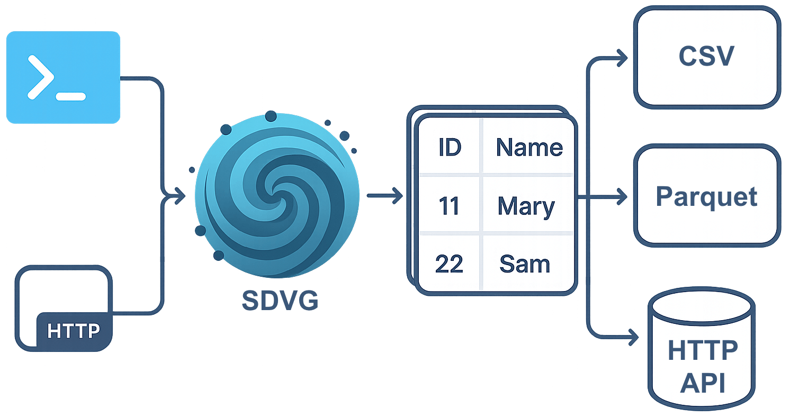

<div class="hide-in-mkdocs">

# Synthetic Data Values Generator (SDVG)

</div>

[![Release][release-badge]][release-url]
[![Pre-release][pre-release-badge]][pre-release-url]
[![CI][actions-badge]][actions-url]
[![Coverage Status][test-coverage-badge]][test-coverage-url]
[![Language][language-badge]][language-url]
[![License][license-badge]][license-url]

[release-badge]: https://img.shields.io/github/v/release/tarantool/sdvg
[release-url]: https://github.com/tarantool/sdvg/releases/latest/
[pre-release-badge]: https://img.shields.io/badge/pre--release-latest-orange
[pre-release-url]: https://github.com/tarantool/sdvg/releases/tag/latest/
[actions-badge]: https://img.shields.io/github/check-runs/tarantool/sdvg/master
[actions-url]: https://github.com/tarantool/sdvg/actions
[test-coverage-badge]: https://img.shields.io/coverallsCoverage/github/tarantool/sdvg?branch=master
[test-coverage-url]: https://coveralls.io/github/tarantool/sdvg?branch=master
[language-badge]: https://img.shields.io/github/languages/top/tarantool/sdvg
[language-url]: https://github.com/tarantool/sdvg/search?l=go
[license-badge]: https://img.shields.io/github/license/tarantool/sdvg
[license-url]: ./LICENSE

<div class="hide-in-mkdocs">

## Язык

- [English](README.md)
- **Русский**

</div>

## Описание продукта

SDVG (Synthetic Data Values Generator) — это инструмент для генерации синтетических данных.
Он поддерживает различные форматы запуска, типы данных для генерации и форматы вывода.



Форматы запуска:

- CLI - генерация данных, создание конфигураций и их валидация через консоль;
- HTTP сервер - принимает запросы на генерацию по HTTP API и отправляет/сохраняет их в указанное место.

Типы данных:

- строки (английские, русские);
- целые и вещественные числа;
- даты со временем;
- UUID.

Типы строк:

- случайные;
- тексты;
- имена;
- фамилии;
- телефонные номера;
- шаблоны.

Каждый из типов данных можно генерировать со следующими опциями:

- указание процента/количества уникальных значений на колонку;
- упорядоченная генерация (sequence);
- указание внешнего ключа;
- идемпотентная генерация по seed числу;
- генерация значений из диапазонов с процентным распределением значений.

Форматы вывода:

- devnull;
- CSV файлы;
- Parquet файлы;
- HTTP API;
- Tarantool Column Store HTTP API.

## Установка

### Стандартная установка

Вы можете установить SDVG, скачав готовый бинарный файл нужной версии
со [страницы релизов на GitHub](https://github.com/tarantool/sdvg/releases).

Скачайте бинарный файл для вашей операционной системы:

```shell
# Linux (x86-64)
curl -Lo sdvg https://github.com/tarantool/sdvg/releases/latest/download/sdvg-linux-amd64
```

```shell
# Linux (ARM64)
curl -Lo sdvg https://github.com/tarantool/sdvg/releases/latest/download/sdvg-linux-arm64
```

```shell
# macOS (x86-64)
curl -Lo sdvg https://github.com/tarantool/sdvg/releases/latest/download/sdvg-darwin-amd64
```

```shell
# macOS (ARM64)
curl -Lo sdvg https://github.com/tarantool/sdvg/releases/latest/download/sdvg-darwin-arm64
```

Установите бинарный файл в систему:

```shell
chmod +x sdvg
sudo mv sdvg /usr/local/bin/sdvg
```

Проверьте, что все работает правильно:

```shell
sdvg version
```

### Сборка и установка из исходников

Для сборки и установки этого инструмента можно использовать команду `go install`:

```shell
# Чтобы установить указанную версию
go install github.com/tarantool/sdvg@0.0.2
# Чтобы установить версию из ветки master
go clean -modcache
go install github.com/tarantool/sdvg@latest
```

Проверьте, что все работает правильно:

```shell
sdvg version
```

## Быстрый старт

Пример модели данных, которая генерирует 10 000 строк пользователей и записывает их в CSV-файл:

```yaml
output:
  type: csv
models:
  user:
    rows_count: 10000
    columns:
      - name: id
        type: uuid
      - name: name
        type: string
        type_params:
          logical_type: first_name
```

Сохраните это в файл `simple_model.yml`, затем выполните:

```bash
sdvg generate simple_model.yml
```

Это создаст CSV-файл с фейковыми пользовательскими данными, такими как `id` и `name`:

```csv
id,name
c8a53cfd-1089-4154-9627-560fbbea2fef,Sutherlan
b5c024f8-3f6f-43d3-b021-0bb2305cc680,Hilton
5adf8218-7b53-41bb-873d-c5768ca6afa2,Craggy
...
```

Чтобы запустить генератор в интерактивном режиме:

```bash
sdvg
```

Чтобы посмотреть доступные команды и аргументы:

```bash
sdvg -h
sdvg --help
sdvg generate -h
```

Больше информации можно найти в [руководстве по эксплуатации](./doc/ru/usage.md).

## Документация

- [Руководство по эксплуатации](./doc/ru/usage.md)
- [Руководство для разработчиков](./doc/ru/contributing.md)
- [Цели и соответствие стандартам](./doc/ru/overview.md)
- [Список изменений](./CHANGELOG.md)
- [Лицензия](./LICENSE)

## Разработчики

- [@hackallcode](https://github.com/hackallcode)
- [@ReverseTM](https://github.com/ReverseTM)
- [@choseenonee](https://github.com/choseenonee)
- [@Hoodie-Huuuuu](https://github.com/Hoodie-Huuuuu)
